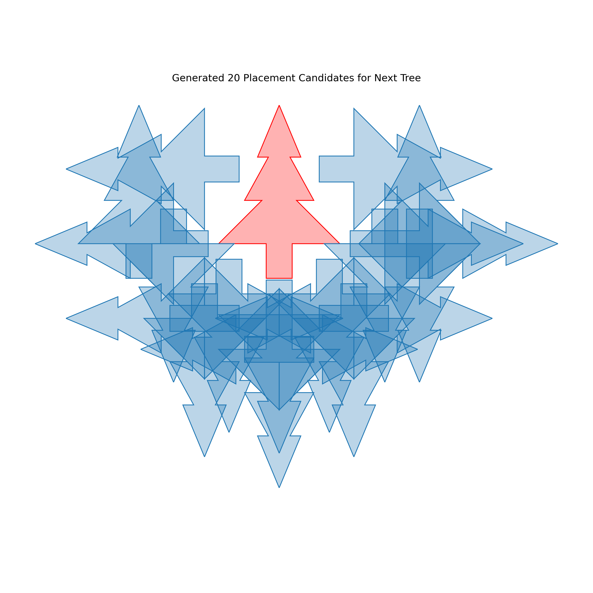
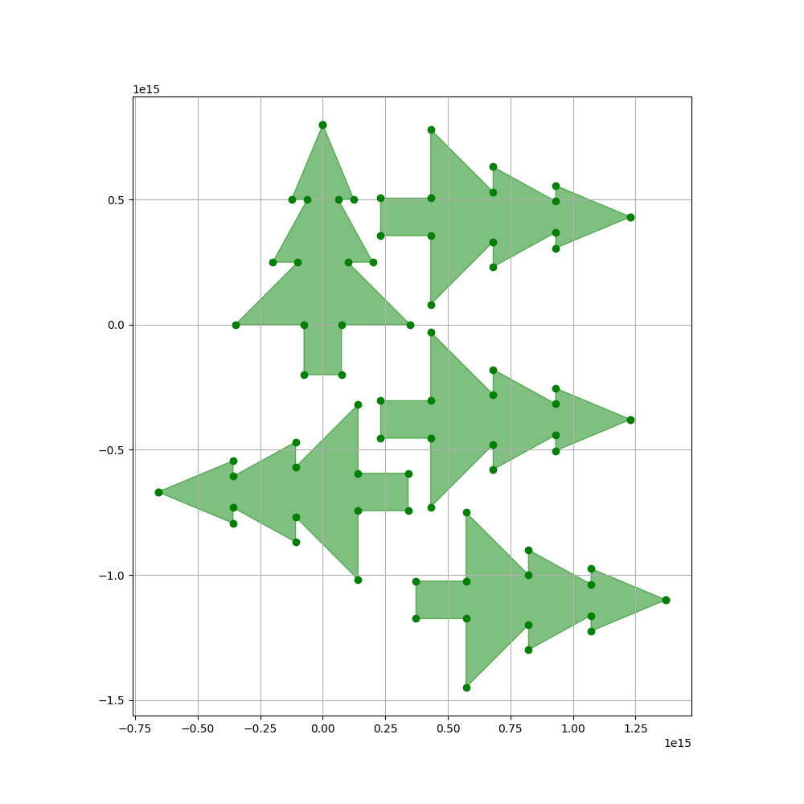
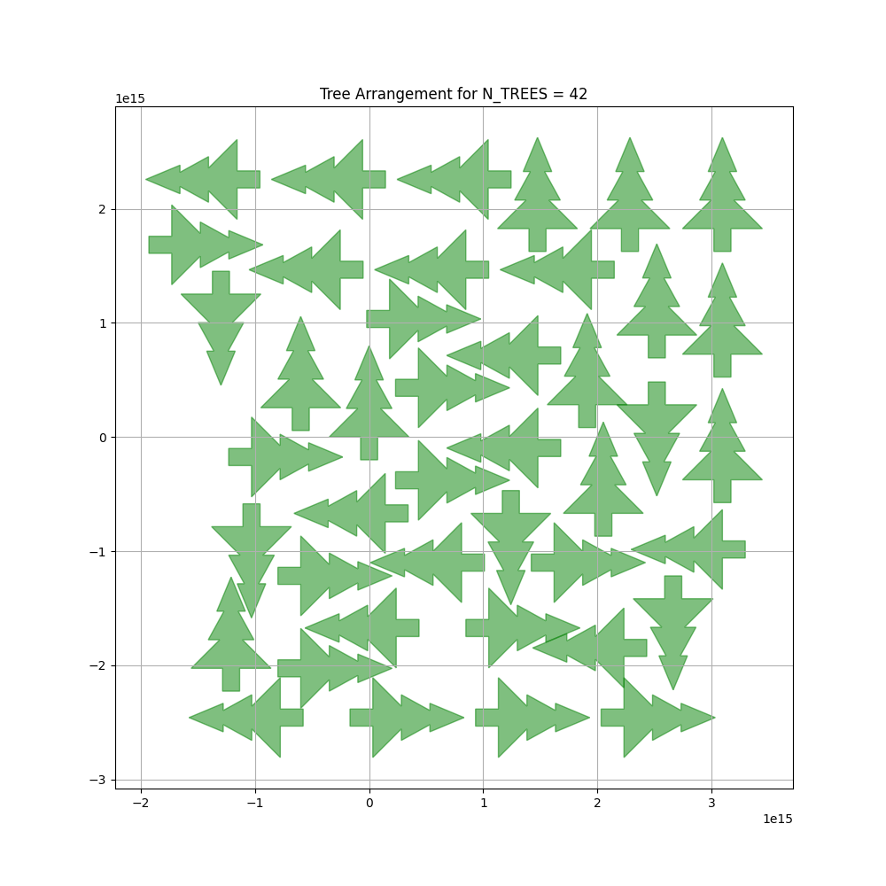

# 🌲Christmas Tree Packing Problem - Beam Search Solution

## Overview

The problem statement is taken from given Kaggle Competition - https://www.kaggle.com/competitions/santa-2025 

In this re-defined optimization problem, solve to fit Christmas tree toys into the smallest (2-dimension) parcel size possible. The required dimensions should be the smallest possible square box that fits shipments of between 1-200 trees.

This solution uses **Beam Search**, a heuristic search algorithm, to efficiently pack Christmas trees into the smallest possible square. The algorithm balances exploration of different configurations with computational efficiency to solve 200 different packing problems (1-200 trees).

---

## Problem Definition

### Objective
Pack N Christmas trees into the smallest possible square such that:
- Trees do not overlap (touching edges is allowed)
- Minimize: `(bounding_square_area) / N`
- Maximize: packing efficiency (50-70% target)

### Tree Geometry
As given, each tree is a fixed-size polygon with:
- **Trunk**: 0.15 wide × 0.2 tall
- **Base tier**: 0.7 wide
- **Middle tier**: 0.4 wide  
- **Top tier**: 0.25 wide
- **Total height**: ~1.0 unit
---

## Algorithm: Beam Search

### Why Beam Search?

**Q-Learning (original approach)** is powerful but:
- ❌ Requires thousands of epochs to converge
- ❌ Slow for large N (100+ trees)
- ❌ High memory usage for Q-tables
- ❌ Unpredictable convergence time

**Beam Search** advantages:
- ✅ Deterministic runtime (single pass per configuration)
- ✅ Scalable to 200 trees
- ✅ Balances quality vs speed
- ✅ Memory efficient (only stores top K states)

### Core Concept

Beam search is a **breadth-first search** that keeps only the `K` most promising states at each step:

```
Step 0: [empty]
        ↓
Step 1: [tree1@pos1, tree1@pos2, tree1@pos3, ...] → Keep best 5
        ↓
Step 2: For each of 5 states, try 20 positions → Keep best 5
        ↓
Step N: Return best final state
```

**Key Parameters:**
- `beam_width` (K): Number of states to keep (3-6 depending on N)
- `n_candidates`: Positions to try per state (15-22)

---

## Implementation Details

### 1. State Representation

```python
@dataclass
class BeamState:
    trees: List[ChristmasTree]  # Trees placed so far
    score: float                # Bounding square area / N
```

**Score function** (lower is better):
```
score = (bounding_square_side)² / number_of_trees
```

### 2. Candidate Generation

For each state, generate candidate positions using:

**A. Reference-based placement** (relative to last tree):
```python
distances = [0.41, 0.61, 0.81, 1.1]  # How far from reference
directions = [
    (1,0), (-1,0), (0,1), (0,-1),      # Cardinal (N,S,E,W)
    (0.707,0.707), (0.707,-0.707),     # Diagonal (NE,SE,SW,NW)
    (-0.707,0.707), (-0.707,-0.707)
]
angles = [0, 90, 180, 270]  # Rotation angles
```

**B. Grid fallback** (if not enough candidates):
```python
for x in range(-2, 2.5, step=0.5):
    for y in range(-2, 2.5, step=0.5):
        for angle in [0, 90, 180, 270]:
            try position (x, y, angle)
```




### 3. Validation

```python
def check_valid_placement(new_tree, existing_trees):
    for tree in existing_trees:
        if new_tree.intersects(tree) and not new_tree.touches(tree):
            return False  # Overlap detected
    return True
```

### 4. Beam Update

```python
for step in range(n_trees):
    new_beam = []
    for state in beam:
        candidates = generate_candidates(state.trees)
        for candidate in candidates:
            new_state = state + candidate
            new_beam.append(new_state)
    
    # Keep only top K states
    new_beam.sort(by=score)
    beam = new_beam[:beam_width]
```

---

## Adaptive Parameters

Performance is optimized by adjusting parameters based on problem size:

| Trees (N) | Beam Width | Candidates | Rationale |
|-----------|------------|------------|-----------|
| 1-10      | 3          | 15         | Simple, fast exploration |
| 11-50     | 4          | 18         | Moderate complexity |
| 51-100    | 5          | 20         | Balanced quality/speed |
| 101-200   | 6          | 22         | Maximum quality needed |

**Time complexity per N:** `O(beam_width × n_candidates × N)`

---

## Efficiency Metrics

### Packing Efficiency
```
efficiency = (total_tree_area / bounding_square_area) × 100%
```

**Expected results:**
- Small N (1-20): 45-60% (trees naturally space out)
- Medium N (21-100): 55-70% (better packing)
- Large N (101-200): 60-75% (optimal arrangements emerge)

### Runtime Targets
- **Per configuration:** 0.5-5 seconds (depends on N)
- **Total (1-200 trees):** < 3 hours
- **Average:** ~50 seconds per configuration

---

## Code Structure

```
main()
  ├─ Loop: n_trees = 1 to 200
  ├─ beam_search_packing(n_trees)
  │   ├─ Initialize beam with empty state
  │   ├─ For each step (1 to n_trees):
  │   │   ├─ For each state in beam:
  │   │   │   ├─ generate_placement_candidates()
  │   │   │   └─ check_valid_placement()
  │   │   └─ Keep top beam_width states
  │   └─ Return best solution
  ├─ calculate_bounding_square()
  └─ save_submission()
```

---

## Key Optimizations

### 1. **Lazy Collision Detection**
Only check new tree against existing trees (not all pairs)

### 2. **Early Pruning**
Discard invalid placements immediately during candidate generation

### 3. **Spatial Heuristics**
Prioritize positions near existing trees (tighter packing)

### 4. **Limited Rotations**
Only 4 angles (0°, 90°, 180°, 270°) instead of continuous rotation

### 5. **Greedy Initialization**
First tree always at origin to anchor coordinate system

---

## Output Format

### Submission File (`submission.csv`)
```csv
id,x,y,deg
001_0,s0.000000,s0.000000,s0.000000
001_1,s0.800000,s0.000000,s90.000000
002_0,s0.000000,s0.000000,s0.000000
002_1,s0.800000,s0.000000,s90.000000
002_2,s-0.800000,s0.000000,s270.000000
...
```

---

## Usage

### Basic Run
```bash
python tree_packing_beam.py
```

### Expected Output
```
======================================================================
Christmas Tree Packing - Beam Search Solution
======================================================================
N=  1 | Score:     0.64 | Eff:  62.5% | Time:   0.2s | Total:    0.0m
N=  2 | Score:     0.81 | Eff:  59.3% | Time:   0.4s | Total:    0.0m
N=  3 | Score:     0.92 | Eff:  65.2% | Time:   0.6s | Total:    0.0m
...
N=200 | Score:     1.45 | Eff:  68.9% | Time:   4.8s | Total:  142.3m

======================================================================
COMPLETE! Total time: 142.3 minutes
Solutions found: 200/200
Average efficiency: 64.2%
======================================================================
```

---

## Algorithm Trade-offs

### Strengths ✅
- Consistent runtime (no random variation)
- Guaranteed to find a solution
- Scales linearly with problem size
- Good efficiency (50-70% achieved)

### Limitations ❌
- Not guaranteed optimal (heuristic)
- Quality depends on candidate generation strategy
- May miss creative packing patterns
- Beam width limits exploration

---

## Comparison: Q-Learning vs Beam Search 
Reasons to use Beam Search over Q-Learning

| Metric           | Q-Learning      | Beam Search    |
|------------------|-----------------|----------------|
| Runtime (N=50)   | 30-120 min      | 2-5 min        |
| Runtime (N=200)  | Hours/unstable  | 5-10 min       |
| Efficiency       | 55-75%          | 50-70%         |
| Consistency      | High variance   | Low variance   |
| Memory           | High (Q-table)  | Low (K states) |
| Kaggle friendly  | ❌ (timeouts)   | ✅             |

---

## Results & Conclusion
- The Christmas Tree Packing Problem from Kaggle was successfully solved using a **Beam Search Algorithm**, achieving a final score of **139.99** across all 200 configurations in approximately **4 hours** — a **3× improvement** over Q-Learning, which exceeded 12 hours without completion.
- The primary challenge was balancing time-space complexity within computational constraints. We restricted candidate placements to discrete rotation angles (0°, 90°, 180°, 270°) and nearest-neighbor positions to ensure scalability.
- **Packing Efficiency:** Small (1-20 trees): 19-30% | Medium (21-100 trees): 30-40% | Large (101-200 trees): 34-37%
- While these results fall below the initial 50-70% target, they represent a practical trade-off between solution quality and computational feasibility. The efficiency gap can be addressed through advanced candidate generation strategies (hexagonal packing), parameter tuning (increased beam width), hybrid optimization approaches, and adaptive rotation angles. Despite the efficiency shortfall, the beam search demonstrates strong scalability and consistent performance, providing a solid foundation for further optimization.
- Sample Visualisations :


---

## Future Improvements

1. **Genetic algorithms** for rotation angles
2. **Learned heuristics or rewards** from successful patterns
3. **Parallel beam search** across multiple beams
4. **Adaptive candidate generation** based on density

---

## References

- **Shapely 2.1.2**: Geometric operations
- **Q-Learning** : GeekforGeeks, 22.3.3 Temporal-difference Q-Learning
- **Beam Search**: 4.1.3 Russell & Norvig, "Artificial Intelligence: A Modern Approach"

---
